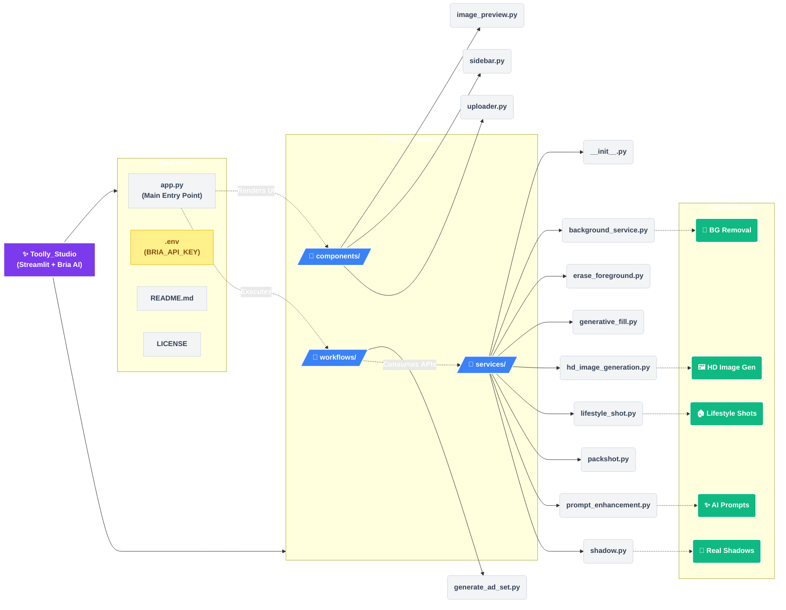

# ✨ Toolly Studio

A powerful Streamlit app for generating professional product ads using Bria AI's advanced image generation and manipulation APIs.

## 🌟 Features

- 🖼️ Generate HD product images from text prompts
- 🎯 Remove backgrounds with custom colors
- 🌅 Add realistic shadows
- 🏠 Create lifestyle shots with text or reference images
- ✨ AI-powered prompt enhancement
- 📝 Optional CTA text overlay
- 🎮 Intuitive UI controls
- 💾 Easy image download



## 🚀 Quick Start

1. Clone the repository:
```bash
git clone https://github.com/AdilShamim8/Toolly_Studio.git
cd adsnap-studio
```

2. Install dependencies:
```bash
pip install -r requirements.txt
```

3. Create a `.env` file in the root directory:
```bash
BRIA_API_KEY=your_api_key_here
```

4. Run the app:
```bash
streamlit run app.py
```

## 💡 Usage

1. Enter a product description or upload an image
2. Configure generation options in the sidebar:
   - Enhance prompt with AI
   - Remove background
   - Add shadows
   - Generate lifestyle shots
3. Adjust advanced settings like background color and shadow intensity
4. Click "Generate Ad" to create your images
5. Download the results

## 🔧 Configuration

The app supports various configuration options through the UI:

- **Prompt Enhancement**: Improve your text prompts with AI
- **Background Removal**: Remove backgrounds with custom colors
- **Shadow Effects**: Add realistic shadows with adjustable intensity
- **Lifestyle Shots**: Place products in context using text or reference images
- **CTA Text**: Add optional call-to-action text overlays

## 🤝 Contributing

1. Fork the repository
2. Create your feature branch (`git checkout -b feature/amazing-feature`)
3. Commit your changes (`git commit -m 'Add amazing feature'`)
4. Push to the branch (`git push origin feature/amazing-feature`)
5. Open a Pull Request

## 📝 License

This project is licensed under the MIT License - see the [LICENSE](LICENSE) file for details.

## 🙏 Acknowledgments

- [Bria AI](https://bria.ai) for their powerful image generation APIs
- [Streamlit](https://streamlit.io) for the amazing web framework 
