# ✨ Toolly Studio

[](https://streamlit.io)
[](https://opensource.org/licenses/MIT)
[](https://www.python.org/downloads/)

**Toolly Studio** is a powerful, intuitive Streamlit web application designed to generate professional-grade product advertisements. By leveraging **Bria AI's** advanced image generation and manipulation APIs, Toolly Studio transforms simple product descriptions or raw images into stunning, market-ready marketing assets.

##  Table of Contents
- [Features](#-features)
- [Architecture](#-architecture)
- [Getting Started](#-getting-started)
- [Usage Guide](#-usage-guide)
- [Configuration](#-configuration)
- [Contributing](#-contributing)
- [License](#-license)

---

## Features

Toolly Studio provides an end-to-end pipeline for product marketing imagery:

- **🖼️ HD Image Generation:** Create high-fidelity product images directly from text prompts.
- **🎯 Smart Background Removal:** Instantly isolate subjects and replace backgrounds with custom hex colors.
- **🌅 Dynamic Shadows:** Ground your products in reality with adjustable, realistic drop shadows.
- **🏠 Contextual Lifestyle Shots:** Place your products into stunning scenes using text descriptions or reference images.
- **✨ AI Prompt Enhancement:** Let AI rewrite your basic prompts into highly optimized generation instructions.
- **📝 CTA Overlays:** Drive conversions by embedding optional Call-To-Action text directly onto your graphics.
- **💾 One-Click Export:** Download your generated assets instantly.

---

## Architecture

Toolly Studio is built with a modular, scalable architecture. Here is a high-level overview of the data flow and directory structure:

```mermaid
graph LR
    %% Custom Styling
    classDef root fill:#7c3aed,stroke:#fff,stroke-width:3px,color:#fff,font-weight:bold
    classDef folder fill:#3b82f6,stroke:#fff,stroke-width:2px,color:#fff
    classDef file fill:#f3f4f6,stroke:#cbd5e1,stroke-width:1px,color:#334155
    classDef feature fill:#10b981,stroke:#fff,stroke-width:2px,color:#fff
    classDef note fill:#fef08a,stroke:#eab308,stroke-width:1px,color:#854d0e

    %% Project Root
    Root["✨ Toolly_Studio<br/>(Streamlit + Bria AI)"]:::root

    %% Directories
    subgraph Architecture ["📂 Project Architecture"]
        direction TB
        Components[/"📁 components/"/]:::folder
        Services[/"📁 services/"/]:::folder
        Workflows[/"📁 workflows/"/]:::folder
    end

    %% Root Files
    subgraph RootFiles ["📄 Root Files"]
        App["app.py<br/>(Main Entry Point)"]:::file
        Env[".env<br/>(BRIA_API_KEY)"]:::note
        Readme["README.md"]:::file
        License["LICENSE"]:::file
    end

    %% Features Mapping
    subgraph Features ["🌟 App Features"]
        direction TB
        F1("🖼️ HD Image Gen"):::feature
        F2("🎯 BG Removal"):::feature
        F3("🌅 Real Shadows"):::feature
        F4("🏠 Lifestyle Shots"):::feature
        F5("✨ AI Prompts"):::feature
    end

    %% Tree Connections
    Root --> RootFiles
    Root --> Architecture

    %% Directory Contents
    Components --> C1("image_preview.py"):::file
    Components --> C2("sidebar.py"):::file
    Components --> C3("uploader.py"):::file

    Services --> S1("__init__.py"):::file
    Services --> S2("background_service.py"):::file
    Services --> S3("erase_foreground.py"):::file
    Services --> S4("generative_fill.py"):::file
    Services --> S5("hd_image_generation.py"):::file
    Services --> S6("lifestyle_shot.py"):::file
    Services --> S7("packshot.py"):::file
    Services --> S8("prompt_enhancement.py"):::file
    Services --> S9("shadow.py"):::file

    Workflows --> W1("generate_ad_set.py"):::file

    %% Logic / Data Flow
    App -.->|"Renders UI"| Components
    App -.->|"Executes"| Workflows
    Workflows -.->|"Consumes APIs"| Services
    
    %% Mapping Services to Features
    S5 -.-> F1
    S2 -.-> F2
    S9 -.-> F3
    S6 -.-> F4
    S8 -.-> F5

```



---

## Getting Started

### Prerequisites

* Python 3.8 or higher
* A [Bria AI](https://bria.ai) API Key

### Installation

1. **Clone the repository:**
```bash
git clone [https://github.com/AdilShamim8/Toolly_Studio.git](https://github.com/AdilShamim8/Toolly_Studio.git)
cd Toolly_Studio

```


2. **Install dependencies:**
It is recommended to use a virtual environment.
```bash
pip install -r requirements.txt

```


3. **Configure Environment Variables:**
Create a `.env` file in the root directory and add your API key:
```bash
echo "BRIA_API_KEY=your_api_key_here" > .env

```


4. **Launch the application:**
```bash
streamlit run app.py

```


---

## Usage Guide

1. **Input Generation:** Start by entering a text description of your product or uploading an existing base image via the main interface.
2. **Configure Pipeline:** Use the left sidebar to toggle the features you need:
* *AI Prompt Enhancement*
* *Background Removal*
* *Shadow Generation*
* *Lifestyle Context*


3. **Fine-Tune:** Adjust advanced sliders for specific requirements (e.g., custom hex codes for backgrounds, shadow intensity, or CTA text).
4. **Generate:** Click **Generate Ad**. Toolly Studio will orchestrate the workflows and hit the necessary Bria AI endpoints.
5. **Export:** Preview the results directly in the UI and click the download button to save your assets.

---

## Configuration Options

Toolly Studio exposes several parameters through the Streamlit UI to give you granular control over the final output:

| Feature | Configuration Options |
| --- | --- |
| **Prompt Enhancement** | Toggle on/off for AI-driven prompt rewriting. |
| **Background Removal** | Toggle on/off, set custom HEX color for the new background. |
| **Shadow Effects** | Toggle on/off, adjust opacity/intensity sliders. |
| **Lifestyle Shots** | Provide a contextual text prompt or upload a reference scene image. |
| **CTA Text** | Input custom string, select basic positioning/overlay styles. |

---

## Contributing

We welcome contributions to make Toolly Studio even better!

1. Fork the repository
2. Create your feature branch (`git checkout -b feature/AmazingFeature`)
3. Commit your changes (`git commit -m 'Add some AmazingFeature'`)
4. Push to the branch (`git push origin feature/AmazingFeature`)
5. Open a Pull Request

---

## License

Distributed under the MIT License. See `LICENSE` for more information.

---

## Acknowledgments

* **[Bria AI](https://bria.ai)** - For their incredibly robust image generation APIs.
* **[Streamlit](https://streamlit.io)** - For the rapid, Pythonic web framework that powers this UI.
